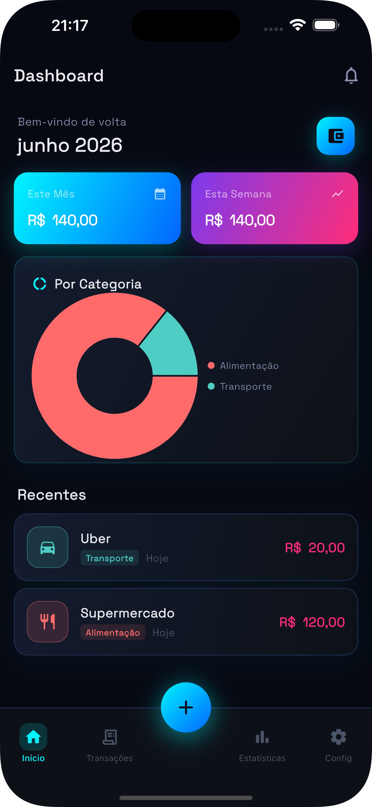
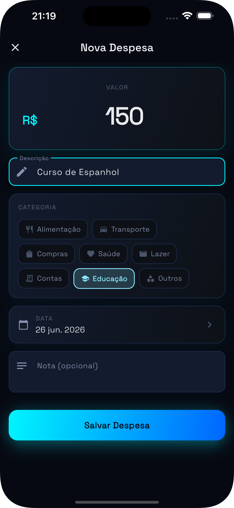
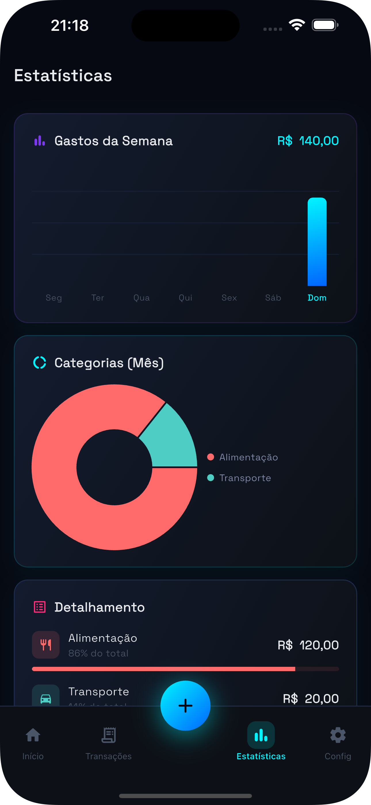
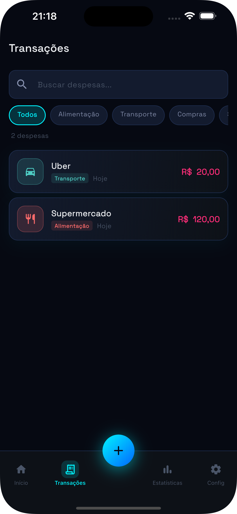

# 💰 Expense Tracker App


Aplicativo mobile para controle de gastos pessoais desenvolvido com Flutter.

O projeto permite registrar despesas, categorizar transações, acompanhar estatísticas financeiras e visualizar relatórios através de uma interface moderna, intuitiva e responsiva.

---

## ✨ Funcionalidades

- 📊 Dashboard financeiro
- 💸 Cadastro de despesas
- 🏷️ Categorização de gastos
- 🔍 Pesquisa e filtragem de transações
- 📈 Estatísticas semanais e mensais
- 🥧 Gráficos de distribuição por categoria
- 📅 Controle por data
- 📝 Adição de observações às despesas
- 📱 Interface mobile moderna e responsiva

---

## 📸 Demonstração

### Dashboard



### Transações



### Estatísticas



### Nova Despesa



---

## 🛠️ Tecnologias Utilizadas

- Flutter
- Dart
- Material Design
- fl_chart
- Flutter SVG

---

## 🎨 Design

O aplicativo utiliza uma interface inspirada em aplicativos fintech modernos, com:

- Tema Dark
- Gradientes e efeitos visuais
- Componentes reutilizáveis
- Navegação intuitiva
- Visualização gráfica de dados
- Experiência focada em dispositivos móveis

---

## 🚀 Como Executar

### Clone o repositório

```bash
git clone https://github.com/seu-usuario/expense_app.git
```

### Acesse a pasta

```bash
cd expense_app
```

### Instale as dependências

```bash
flutter pub get
```

### Execute o aplicativo

```bash
flutter run
```

---

## 📂 Estrutura do Projeto

```text
lib/
├── models/
├── screens/
├── widgets/
├── services/
├── theme/
└── main.dart
```

---

## 📚 Objetivos do Projeto

Este projeto foi desenvolvido com foco em:

- Desenvolvimento mobile com Flutter
- Gerenciamento de estado
- Organização de código
- Criação de interfaces modernas
- Visualização de dados financeiros
- Construção de projetos para portfólio

---

## 👩‍💻 Desenvolvedora

Karen Felix

GitHub: https://github.com/karenfrocha/karenfrocha

LinkedIn: https://www.linkedin.com/in/karenfelixrocha

